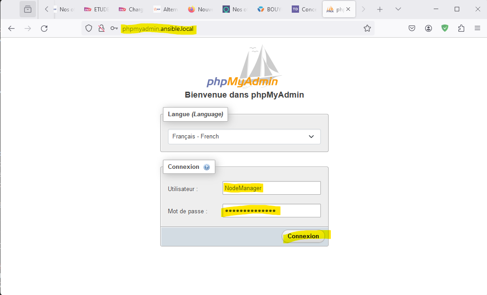
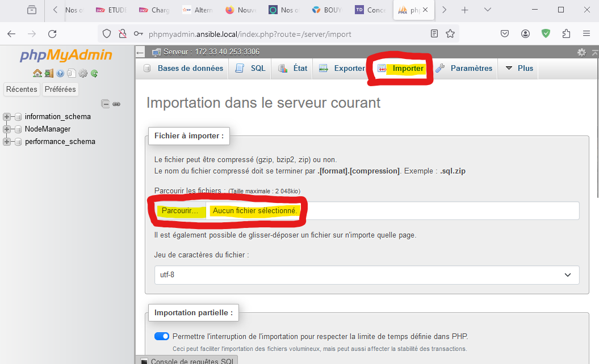
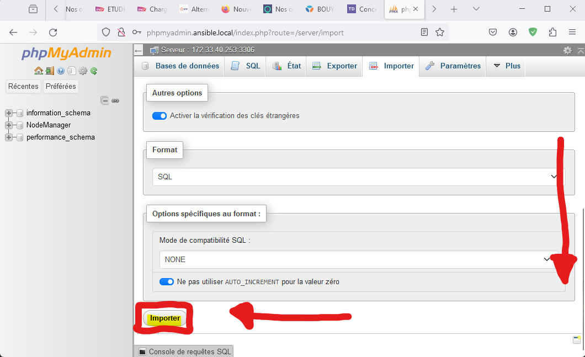

## Travail réalisé par Baptiste BORDENAVE

# QuickWeb : Déploiement express de sites-web

### 1 - Prérequis
Il est nécessaire d'installer certains paquets sur votre machine linux (ici `Ubuntu` et `Debian`) afin de pouvoir télécharger et exploiter les scripts. Assurez-vous aussi que la virtualisation est activée.
1) Installer docker :
```shell
# Ajout du repository dans apt pour installer Docker
apt update
apt install ca-certificates curl gnupg
install -m 0755 -d /etc/apt/keyrings
curl -fsSL https://download.docker.com/linux/ubuntu/gpg | sudo gpg --dearmor -o /etc/apt/keyrings/docker.gpg
chmod a+r /etc/apt/keyrings/docker.gpg

echo \
  "deb [arch=$(dpkg --print-architecture) signed-by=/etc/apt/keyrings/docker.gpg] https://download.docker.com/linux/ubuntu \
  $(. /etc/os-release && echo "$VERSION_CODENAME") stable" | \
  tee /etc/apt/sources.list.d/docker.list > /dev/null
apt-get update

# Installation de docker via APT
apt install docker-ce docker-ce-cli containerd.io docker-buildx-plugin docker-compose-plugin

# Vérifier que Docker est bien actif.
docker run hello-world
```
2) Installation de Git et de Python3
```shell
apt install git python3 -y
```
3) Mettre à jour l'ensemble des paquets
```shell
apt upgrade
```

### 2 - Installation du projet
1) Cloner le repository git
```shell
git clone https://github.com/Ari33260/SAE502.git
```
2) Activer l'environnement virtuel Python v-env
```shell
source SAE502/bin/activate
```
> Info : A partir de là, vous aurez déjà Ansible et ainsi que l'ensemble des modules nécessaires qui seront installés.
3) Construire l'image Docker `debian-ssh-py`
```shell
cd SAE502/ressources/Dockerfile
docker build . -t debian-ssh-py:v14
```
>Info : Le fait de construire l'image à cet instant vous garanti une version de l'image de base `ubuntu` et des paquets à jours.

### 3 - Paramétrages
Lorsque vous installez les scripts, il y a des paramètres de bases qui sont déjà appliqués, il est possible que cela ne réponde pas à vos exigences et-ou contraintes.
1) Changer l'adresse réseau.\
Vous pouvez changer ses paramètres dans `inventories/inventaire.ini` ligne `163` section `parameters`
```ini
[parameters]
Docker NameBridge="MON_LAN" CIDR="XXX.XXX.XXX.XXX/ZZ" Gateway="YYY.YYY.YYY.YYY"
```
Pour ce qui est des adresses IP des hôtes, vous pouvez vous aider du fichier `ressources/plannification.xlsx` ou des commandes `Unix`

2) Changer les paramètres de la base de données `mysql` \
Vous pouvez changer ses paramètres dans `inventories/inventaire.ini` ligne `157` section `bdd` 

>  - Mot de passe root : `mysql_root_password`
>  - Nom de la première base de données : `mysql_database`
>  - Nom d'utilisateur *(non root)* : `mysql_user`
>  - Mot de passe utilisateur *(non root)* : `mysql_password`
```ini \
[bdd]
bdd1 ansible_host=172.33.40.253 mysql_root_password=Mon_MDP_root mysql_database=Ma_data_base mysql_user=Mon_user mysql_password=Mon_mdp_user
```

3. Modifier le F.Q.D.N et mettre en place un filtre IP du visionneur de base de données (PhpMyAdmin) \
Vous pouvez changer ces paramètres dans `inventories/inventaire.ini` ligne `160` section `phpmyadmin`
```ini
[phpmyadmin]
phpmyadmin .. FQDN=MON_FQDN ACL="ACL1,ACL2"
```
> Exemple d'ACL sur Apache : \
Pour autoriser par exemple le réseau `172.33.40.0/24` et la machine `161.3.131.0` à accéder à phpmyadmin :
> - `Require ip 172.33.40.0/24` \
    `Require ip 161.3.131.0`
>
> Ce qui nous donnerait donc  :
> ```ini
> phpmyadmin .. FQDN=MON_FQDN ACL="Require ip 172.33.40.0/24,Require ip 161.3.131.0"
> ```
Pour finir, avec le F.Q.D.N défini, créer un enregistrement DNS de type A qui pointe sur votre adresse IP publique de votre machine physique afin de pouvoir accéder à PHPMyAdmin :
```shell
MON_FQDN_PHP_MY_ADMIN IN A ADD_IP_PUB_MACHINE_PHYSIQUE
```

4. Migrer le contenu d'un système MySQL. \
Si votre ancienne machcine SQL était sous MySQL, vous pourrez directement migrer tout son contenu présent dans `/var/lib/mysql` directement dans le dossier `ressources/sql`. \
Pour migrer le contenu vous pouvez vous aider de `scp` ou encore `git` :
```shell
cd ressources/sql
scp -r utilisateur@adresse_distante:/var/lib/mysql/ .
```
*Attention : Si vous avez défini des paramètres BDD dans `inventaire.ini`, ils peuvent être impactés avec cette méthode de migration.* \
->Vous pouvez utiliser une autre méthode de migration si celle-ci n'est pas satisfaisante : **PARTIE 4** section **???**

### 4 - Déploiement
Dans un premier temps, lancer le script qui permet d'initier le tout :
```shell
bash start.bash
```
Compter 3 à 5 minutes le temps que la base se déploie.

1) Ajouter un site-web :
```shell
bash website.bash add GIT_URL FQDN ACL
```
`GIT_URL` : Un lien .git est attendu, ce git doit d'agir d'un site-web. \
`FQDN` : Il doit correspondre au "nom" de domaine voulu pour ce site \
`ACL` (*non obligatoire*) : Argument à utiliser si vous souhaitez restreindre l'accès à certains réseaux ou machines.
> Exemple : Pour autoriser par exemple le réseau `172.33.40.0/24` et la machine `161.3.131.0` au site-web à déployer:
> - `Require ip 172.33.40.0/24` \
    `Require ip 161.3.131.0`
>
> Ce qui nous donnerait donc  :
> ```ini
> bash website.bash add https://exemple.net/website.git exemple.fr ACL="Require ip 172.33.40.0/24,Require ip 161.3.131.0"
> ```
Le script va scanner tous les hosts défini dans `inventaire.ini` puis va comparer logiquement s'il existe en tant que "conteneur", il va prendre directement le premier qui n'existe pas.

2) Supprimer un site-web \
Supprimer un site-web est très simple, il suffit de taper son **FQDN** :
```shell
bash website.bash del FQDN
```
> Exemple : Je veux supprimer le site avec le FQDN `test.tdf.fr` :
>```shell
>bash website.bash del test.tdf.fr
>```

### 5 - Mettre à jour la base de données via l'IHM
Si votre ancienne base n'était pas sous MySQL, il est nécessaire de passer par cette étape. \
L'objectif est d'utiliser l'I.H.M de PHPMyAdmin afin d'insérer un fichier SQL.
1) Connectez-vous à PHPMyAdmin 

Paramètres par défaut :
     - URL : `http://phpmyadmin.ansible.local`
     - Utilisateur : `NodeManager`
     - Mot de passe : `rootdocker2024`

2) Importer le fichier \
Lorsque vous arriverez sur la page "principale", se rendre dans l'onglet `Importer` puis sélectionner son fichier `sql` ou compressé (mais il doit comporter au moins le format : `.sql.zip`) :


3) Appliquer l'import
